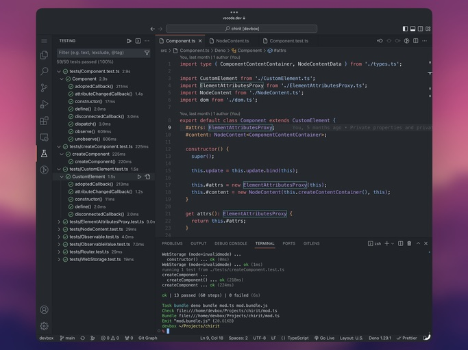
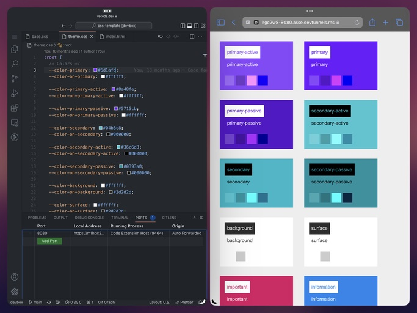

# devbox

A container as a development environment.





## How to use the devbox container

### GitHub Codespaces

To use the devbox container in GitHub Codespaces, create a codespace on this repository.
That's all.

### Visual Studio Code Server

To use the devbox container as a Visual Studio Code Server that can be accessed locally, run the following in your terminal, then open http://localhost:8000/ in your browser.

```sh
docker run --name devbox -p 8000:8000 -d docker.io/akiraohgaki/devbox
```

To use the devbox container as a Visual Studio Code Server that can be accessed from https://vscode.dev/ and from any Visual Studio Code desktop, run the following in your terminal, then follow the on-screen instructions.

```sh
docker run --name devbox -ti docker.io/akiraohgaki/devbox code tunnel
```

### Use with terminal

You can also start the devbox container with any command, such as zsh, so that Visual Studio Code Server does not start automatically.

```sh
docker run --name devbox -ti docker.io/akiraohgaki/devbox zsh
```

### Tips

The first time it is run, the setup process runs and automatically generates SSH keys for the user inside the container, and also preconfigures tools (for example, ZSH, Git, Vim, and Visual Studio Code Server).

## Pre-installed developer tools

Ubuntu based container is running and ready to develop with below.

- Visual Studio Code Server
- Vim
- Git
- C/C++
- Java
- Python
- Rust
- Deno
- Node.js
- and many more tools

## Default user

The default user has sudo privileges, but no password is required.

- Username: devbox (UID: 1000)
- Groupname: devbox (GID: 1000)
- Password: devbox
- Shell: /bin/zsh
- sudo: Full privileges

## Personalization of the devbox container

The devbox container can be personalized by `/devbox/setup-additions/system.sh` and `/devbox/setup-additions/user.sh` on first run.

For example, create the following bash scripts in a local directory on the host OS and run the devbox container that has mounted the local directory as `/devbox/setup-additions`.

[ setup-additions/system.sh ]

```bash
#!/bin/bash

# Install additional packages
sudo apt update
DEBIAN_FRONTEND=noninteractive sudo apt install -y --no-install-recommends \
  tmux p7zip-full
```

[ setup-additions/user.sh ]

```bash
#!/bin/bash

# Copy SSH key pair
sudo cp /devbox/setup-additions/ssh/id_* ${HOME}/.ssh/
sudo chown $(id -un):$(id -gn) ${HOME}/.ssh/id_*
chmod 600 ${HOME}/.ssh/id_*
chmod 644 ${HOME}/.ssh/id_*.pub

# Configure user name and email in Git
git config --global user.name "Full Name"
git config --global user.email "username@example.com"
```

Runs the devbox container with the setup-additions directory mounted.

```sh
docker run --name devbox -p 8000:8000 -d \
  -v $(pwd)/setup-additions:/devbox/setup-additions:ro \
  docker.io/akiraohgaki/devbox
```
